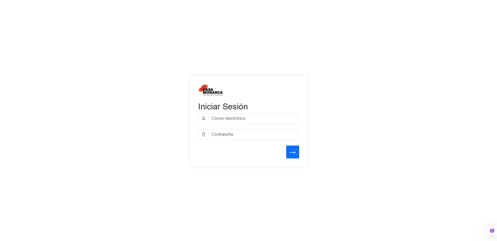

# Casa Monarca Project

<div align="center">
  
</div>

## Overview

The Casa Monarca project is a web application designed to support Casa Monarca's work with migrants seeking political aid. The platform provides a comprehensive system for workers to access accounts, track client documentation, and manage the processing of political documents required for migrants to maintain legal status in other countries.

The application features a secure dashboard that enables Casa Monarca staff to monitor client cases, process documentation, and provide timely support to migrants navigating complex immigration processes.

## Key Features

### User Authentication
- Secure login system for Casa Monarca staff
- Role-based access control
- Session management with security protections

<div align="center">
  
</div>

### Client Tracking Dashboard
- Comprehensive view of all client cases
- Status tracking for document processing
- Historical record of client interactions

### Document Management
- Digital document generation for political aid applications
- Document upload and storage capabilities
- Document history tracking with timestamps

### Electronic Signature System
- Secure document signing functionality
- RSA encryption for document protection
- Electronic signatures with tamper detection
- Document integrity verification

### Security Measures
- Implementation of cybersecurity best practices
- Data encryption for sensitive information
- Privacy protections for client personal information
- Secure document storage and transmission

### Document Verification Portal
- Public verification of document validity and expiration status using public keys
- Complete document access available only with private key authentication
- Tamper-evident document verification

## Solution to Problematics

| Problem | Solution |
|---------|----------|
| Document security and integrity concerns | Implementation of RSA encryption and electronic signatures to ensure documents cannot be tampered with |
| Difficulty tracking client cases and status | Comprehensive dashboard with real-time status updates and historical tracking |
| Privacy of sensitive migrant information | Data encryption and strict access controls to protect personal information |
| Verification of document authenticity | Public/private key system allowing verification while maintaining security |
| Manual document processing leading to delays | Streamlined digital document generation and processing workflows |
| Limited accessibility for staff members | Cloud-based system allowing secure access from multiple locations |
| Audit trail requirements for legal documents | Comprehensive logging and timestamp system for all document actions |

## Architecture


## Security Considerations

This application was developed with a strong focus on:
- Transparency in document processing
- Reliability and system stability
- Data privacy and security
- Encryption of sensitive information
- Access control mechanisms

## Running the Project

### Option 1: Python (Development)

1. Install dependencies:
   ```
   pip install -e .
   ```

2. Set up environment variables by creating a `Casa_Monarca/db.env` file with your Cosmos DB credentials

3. Run the application:
   ```
   python app.py
   ```

4. Access the application at http://localhost:5000

### Option 2: Docker (Recommended)

1. Build and start the containers:
   ```
   docker-compose up --build
   ```

2. For subsequent runs:
   ```
   docker-compose up
   ```

3. Access the application at http://localhost:5000

Note: Make sure to create the required secret files in the `./secrets/` directory before running with Docker.
