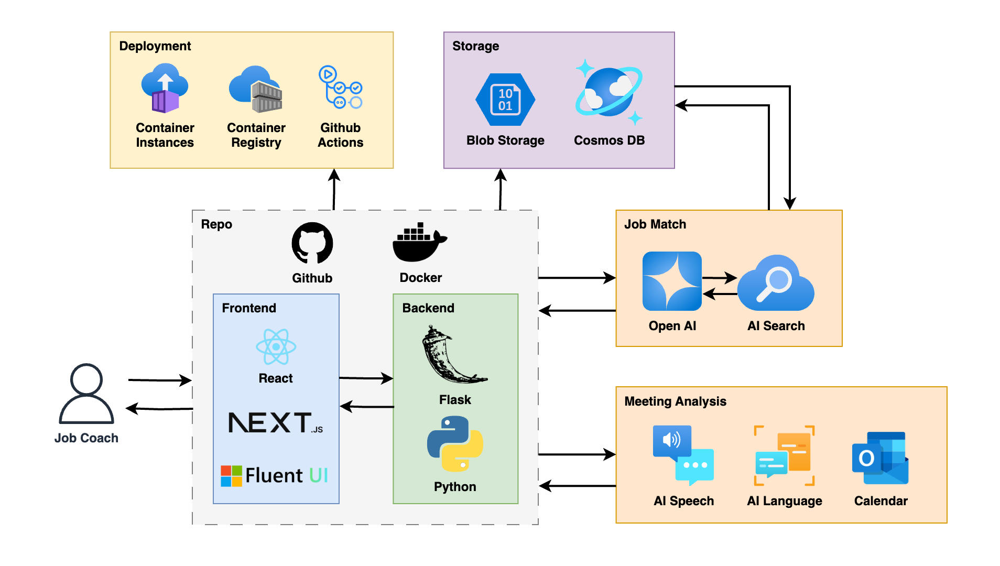

# Casa Monarca Project

  

## Overview

The Casa Monarca project is a web application designed to support Casa Monarca's work with migrants seeking political aid. The platform provides a comprehensive system for workers to access accounts, track client documentation, and manage the processing of political documents required for migrants to maintain legal status in other countries.

The application features a secure dashboard that enables Casa Monarca staff to monitor client cases, process documentation, and provide timely support to migrants navigating complex immigration processes.

## Key Features

### User Authentication
- Secure login system for Casa Monarca staff
- Role-based access control
- Session management with security protections

### Client Tracking Dashboard
- Comprehensive view of all client cases
- Status tracking for document processing
- Historical record of client interactions

### Document Management
- Digital document generation for political aid applications
- Document upload and storage capabilities
- Document history tracking with timestamps

### Electronic Signature System
- Secure document signing functionality
- RSA encryption for document protection
- Electronic signatures with tamper detection
- Document integrity verification

### Security Measures
- Implementation of cybersecurity best practices
- Data encryption for sensitive information
- Privacy protections for client personal information
- Secure document storage and transmission

### Document Verification Portal
- Public verification of document validity and expiration status using public keys
- Complete document access available only with private key authentication
- Tamper-evident document verification

## Technical Implementation

The application is built using:
- Python Flask web framework
- Azure Cosmos DB for data storage
- Docker containerization for deployment
- Modern HTML/CSS frontend with responsive design

## Architecture

## Security Considerations

This application was developed with a strong focus on:
- Transparency in document processing
- Reliability and system stability
- Data privacy and security
- Encryption of sensitive information
- Access control mechanisms
